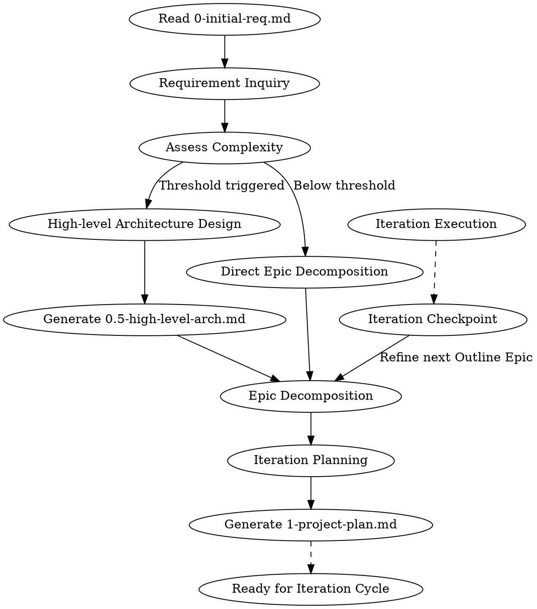
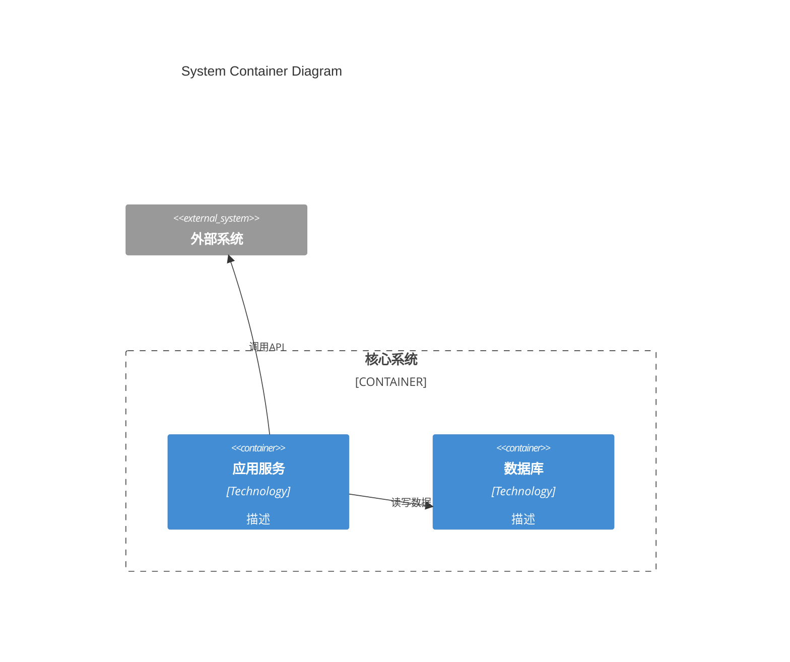
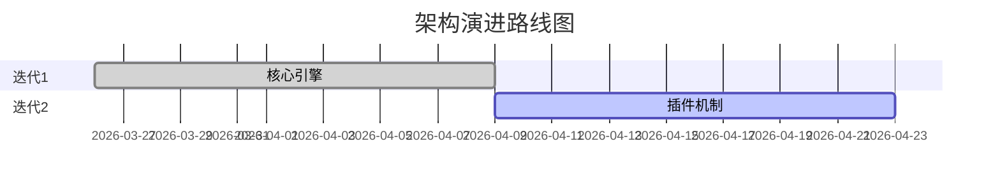
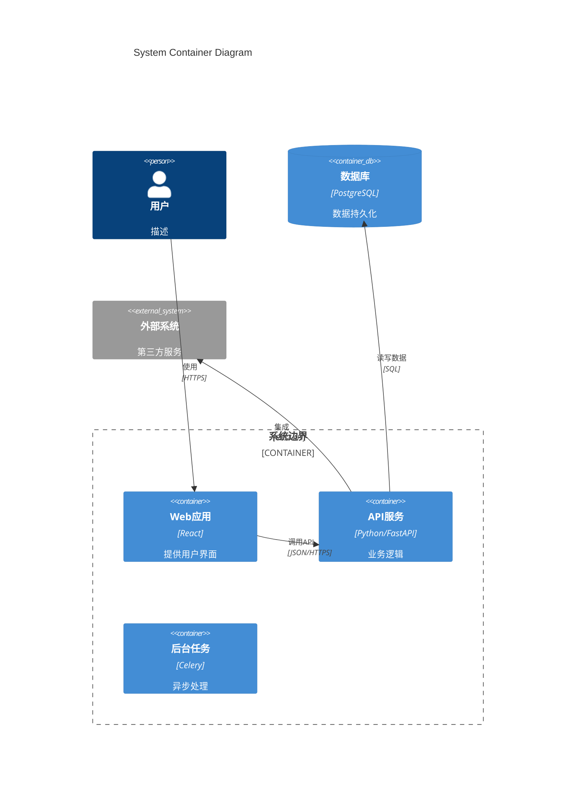
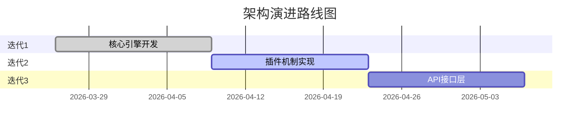
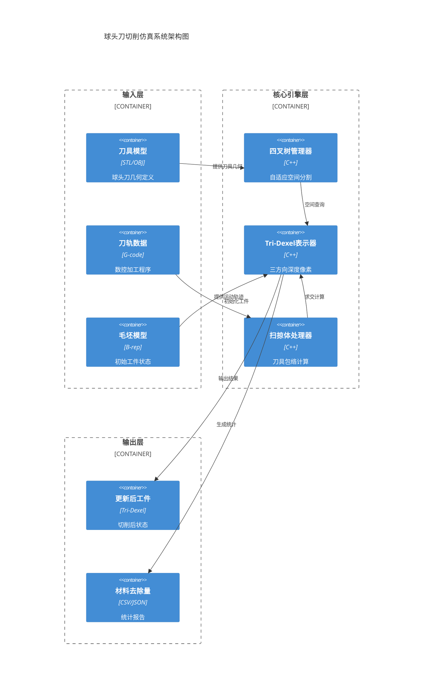
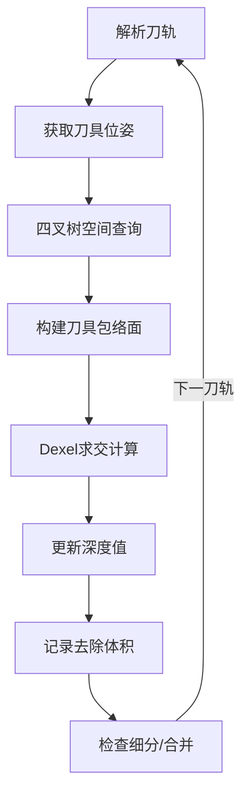
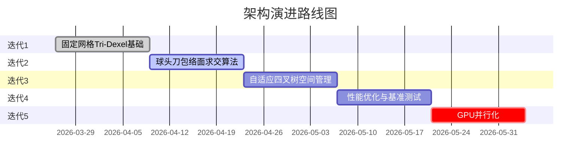

# project-planning Skill Implementation Plan

> **Version:** 1.b
> **Updated:** 2026-03-26
> **Review Comments:** 已整合架构师&敏捷教练评审意见（6项优化要求）

> **For agentic workers:** REQUIRED SUB-SKILL: Use superpowers:subagent-driven-development (recommended) or superpowers:executing-plans to implement this plan task-by-task. Steps use checkbox (`- [ ]`) syntax for tracking.

**Goal:** Create a new superpowers skill `project-planning` that bridges initial requirements to **Epic-level roadmap** with optional high-level architecture design, supporting rolling wave planning.

**Architecture:** Follow existing superpowers skill structure (like `brainstorming`, `writing-plans`). The skill consists of a main SKILL.md document, sub-agent prompt files for modular execution, and example templates. Uses YAML frontmatter for metadata and markdown for content.

**Tech Stack:** Markdown, YAML, superpowers skill framework

---

## 文件结构

```
skills/project-planning/
├── SKILL.md                          # 主技能文档 - 入口和工作流（EN）
├── SKILL-zh.md                       # 【中文对照】SKILL.md 完整翻译
├── project-planner-prompt.md         # 项目规划子Agent提示词（EN）
├── project-planner-prompt-zh.md      # 【中文对照】project-planner-prompt.md
├── arch-designer-prompt.md           # 架构设计子Agent提示词（EN）
├── arch-designer-prompt-zh.md        # 【中文对照】arch-designer-prompt.md
└── examples/
    ├── 0-initial-req-example.md      # 示例输入文档（中文）
    ├── 0.5-high-level-arch-example.md # 示例架构输出（中文，Mermaid图表）
    └── 1-project-plan-example.md     # 示例项目计划（中文，含Iteration Checkpoint）
```

**语言规范说明：**
- **执行用**：`SKILL.md`, `project-planner-prompt.md`, `arch-designer-prompt.md`（英文）
- **解释用**：`*-zh.md` 文件（中文对照，仅用于人工阅读理解）
- **维护要求**：当英文版本修改时，必须同步更新对应的中文版本，或在文档顶部添加「待更新」提示

---

## 核心原则（评审优化重点）

### 1. 职能边界明确化
- **project-planning** 仅产出 **Epic级别的路线图（Roadmap）**
- **严禁**产出Task级别的代码实现步骤
- Task级别规划必须由下游 **writing-plans** 技能完成

### 2. 量化架构触发阈值（Phase 2）
满足以下任一条件时，**强制**生成 `0.5-high-level-arch.md`：
- 涉及 **3个以上** 内部组件/服务交互
- 涉及 **2个以上** 外部API/系统集成
- 预估代码量 **5000行以上**
- 新系统/平台（无现有架构可参考）

### 3. 滚动计划闭环
每个迭代结束后，必须通过 **Iteration Checkpoint** 重新激活本技能，将下一个 Outline 状态的 Epic 细化为 Detailed 状态。

---

## Task 1: 创建技能目录结构

**文件：**
- 创建：`skills/project-planning/` 目录
- 创建：`skills/project-planning/examples/` 目录

- [ ] **Step 1: 创建目录**

```bash
mkdir -p skills/project-planning/examples
```

- [ ] **Step 2: 验证结构**

```bash
ls -la skills/project-planning/
```

预期：`examples` 目录存在

- [ ] **Step 3: 提交**

```bash
git add skills/project-planning/
git commit -m "chore: create project-planning skill directory structure"
```

---

## Task 2: 编写主 SKILL.md 和 SKILL-zh.md

### 修订要点（评审优化 1 & 3 & 5）

**文件：**
- 创建：`skills/project-planning/SKILL.md`（英文执行版）
- 创建：`skills/project-planning/SKILL-zh.md`（中文对照版 + 双语同步检查逻辑）

---

### Task 2.1: 编写 SKILL.md

- [ ] **Step 1: 编写 SKILL.md 头部和概述**

创建 `skills/project-planning/SKILL.md`：

```markdown
---
name: project-planning
description: Use when transforming initial requirements into an Epic-level roadmap with optional high-level architecture. Outputs 1-project-plan.md (Epics only) and optionally 0.5-high-level-arch.md. Task-level implementation planning is STRICTLY delegated to downstream writing-plans skill.
---

# Project Planning

## Overview

**职能边界明确**：本技能仅产出 **Epic级别的项目路线图**，严禁产出Task级代码实现步骤。

Transform `0-initial-req.md` into `1-project-plan.md` (Epic-level roadmap) with optional `0.5-high-level-arch.md` for complex projects.

**Announce at start:** "I'm using the project-planning skill to create an Epic-level roadmap from your initial requirements. Task-level planning will be handled by writing-plans skill during iteration execution."

**Input:** `0-initial-req_YYYYMMDD_v{X}.{Y}.md` (customer requirements)
**Outputs:**
- `0.5-high-level-arch_YYYYMMDD_v{X}.{Y}.md` (optional, triggered by quantitative thresholds)
- `1-project-plan_YYYYMMDD_v{X}.{Y}.md` (Epic-level roadmap with iteration assignments)

**Key Concepts:**
- **Rolling Wave Planning**: Project plan evolves iteratively - only immediate iterations need detailed planning
- **Planning Horizon**: detailed (current+1 iteration) / outline (next 2-3) / vision (future)
- **Epic**: Large requirement that may span multiple iterations. **NOT** task-level implementation steps.
- **Boundary**: Epic planning (this skill) → Task planning (writing-plans skill)
```

- [ ] **Step 2: 添加工作流章节（含量化架构阈值）**

追加到 `skills/project-planning/SKILL.md`：

```markdown
## The Process



### Phase 1: Requirements Clarification (Mandatory)

**硬性约束（Inquiry First）**：在继续之前，必须确认以下要素已明确：
- ✅ 核心业务逻辑清晰（输入→处理→输出）
- ✅ 关键性能指标已定义（延迟、吞吐量、精度等）
- ✅ 集成边界明确（与哪些系统交互，接口协议）

如有任何一项不明确，**禁止**生成计划，必须先输出 Requirement Inquiry 列表。

Read `0-initial-req.md` and identify:
- Unclear requirements (contradictions, ambiguities, boundaries)
- Missing information needed for planning
- Technical constraints and assumptions

**Ask clarifying questions one at a time** until requirements are clear enough for planning.

### Phase 2: Complexity Assessment (Quantitative Thresholds)

**量化架构触发阈值** - 满足任一条件必须生成架构文档：

| 量化指标 | 阈值 | 强制架构 |
|:---------|:-----|:---------:|
| 内部组件/服务交互 | ≥ 3个 | ✅ 是 |
| 外部API/系统集成 | ≥ 2个 | ✅ 是 |
| 预估代码量 | ≥ 5000行 | ✅ 是 |
| 新系统/平台 | 无现有架构可参考 | ✅ 是 |
| 简单功能增强 | < 以上所有阈值 | ❌ 否 |
| 单文件工具 | < 以上所有阈值 | ❌ 否 |

### Phase 3: High-level Architecture (if triggered)

Create `0.5-high-level-arch.md` with:
- Architecture vision and key capabilities
- **Mermaid C4 Container diagram** (standardized syntax)
- Component responsibilities and interfaces (abstract only)
- Data flow for main use cases
- Technology choices (with rationale)
- **Mermaid evolution roadmap diagram**

### Phase 4: Epic Decomposition

Break requirements into **Epics only** (NO task-level details):
- Each Epic should deliver user-visible value
- Epics can span multiple iterations
- Prioritize: Critical > High > Medium > Low
- **Epic granularity**: Feature-level, not implementation-level

### Phase 5: Iteration Planning (Rolling Wave)

Plan with three horizon levels:

| Horizon | Detail Level | Content |
|---------|-------------|---------|
| **Detailed** | Epic-level with acceptance criteria | Current + next iteration |
| **Outline** | Epic-level only | Next 2-3 iterations |
| **Vision** | Theme-level | Future iterations |

**注意**：此处仅为Epic分配，具体Task规划由下游技能完成。

Output `1-project-plan.md` with:
- Project team and background
- Epic list with priorities and horizon status
- Iteration roadmap (Epic assignments only)
- Architecture reference (if exists)
- **Iteration Checkpoint procedure**

## Rolling Wave Planning & Update Loop

Project plan is **not frozen** - it evolves between iterations:

1. **Start**: Only Iteration 1 needs detailed Epic planning
2. **Between iterations**: Based on retrospective, refine next iteration's plan
3. **Upgrade horizon**: As project progresses, outline → detailed, vision → outline
4. **Iteration Checkpoint** (Critical): After each iteration completes:
   - Re-activate project-planning skill
   - Select next "outline" Epic to refine to "detailed"
   - Update `1-project-plan.md` with new insights

Document all changes in `1-project-plan.md` version history.
```

- [ ] **Step 3: 添加集成和规则章节（强调职能边界）**

追加到 `skills/project-planning/SKILL.md`：

```markdown
## Integration with Other Skills

**职能边界明确**：

| 层级 | 本技能 (project-planning) | 下游技能 (writing-plans) |
|:-----|:--------------------------|:-------------------------|
| **输出** | Epic路线图、迭代分配 | Task级实现步骤、代码规划 |
| **粒度** | Feature-level | Implementation-level |
| **时机** | 项目启动、迭代CheckPoint | 迭代内执行前 |

**Downstream skills:**
- `superpowers:brainstorming` - Used per-Epic during iteration cycle for detailed design
- `superpowers:writing-plans` - **Creates task-level implementation plan from Epic** (NEVER done by this skill)
- `superpowers:subagent-driven-development` - Executes the plan

**Workflow sequence:**
```
project-planning (project level - Epic roadmap)
    ↓
brainstorming (per-Epic detailed design)
    ↓
writing-plans (task-level implementation plan) ← NOT in this skill
    ↓
subagent-driven-development (execution)
    ↓
[Retrospective] → [Iteration Checkpoint] → [Re-activate project-planning] → [Next iteration]
```

## Document Formats

### 0-initial-req.md Input Format

```yaml
---
doc_type: project-proposal
version: "1.0"
updated: "2026-03-26"
company: {name: "{{COMPANY_NAME}}", short: "{{COMPANY_SHORT}}"}
---

# 立项报告与需求列表

## 1 背景介绍
...

## 2 项目/产品价值
...

## 3 项目需求
### 3.3 需求列表
| 序号 | 名称 | 描述 | 优先级别 |
|:---:|:---|:---|:---:|
| 1 | ... | ... | 关键 |
```

### 0.5-high-level-arch.md Output Format

```yaml
---
doc_id: "ATF-ARCH-001"
doc_type: high-level-architecture
project_name: "ProjectName"
version: "1.a"
updated: "2026-03-26"
status: evolving
scope:
  current: "Core framework"
  future: "Plugin ecosystem"
---

# 高阶架构设计

## 1. 架构愿景
...

## 2. 总体架构图 (C4 Container)



## 3. 核心组件
...

## 4. 数据流
...

## 5. 技术选型
...

## 6. 演进路线图


```

### 1-project-plan.md Output Format

```yaml
---
doc_id: "ATF-PROJ-001"
doc_type: project-plan
project_name: "ProjectName"
version: "1.a"
updated: "2026-03-26"
status: rolling
planning_horizon:
  detailed: "迭代1-2"
  outline: "迭代3-5"
  vision: "迭代6+"
---

# 项目计划

## 1 项目组成员
...

## 2 项目背景介绍
...

## 3 项目价值
...

## 4 计划需求列表 (Epics)
| 编号 | 名称 | 描述 | 优先级 | 状态 | 目标迭代 |
|:---:|:---|:---|:---:|:---:|:---:|
| FR1 | 核心引擎 | ... | 关键 | detailed | 迭代1-2 |
| FR2 | 用户界面 | ... | 高 | outline | 迭代3-4 |

## 5 迭代规划

### 5.1 迭代1 - 详细规划
**范围：** Epic FR1
**交付标准：** [验收标准，非实现步骤]

### 5.2 迭代2-3 - 大纲规划
**范围：** Epics FR2, FR3

### 5.3 迭代4+ - 愿景规划
**范围：** 主题级描述

## 6 迭代检查点 (Iteration Checkpoint)

**滚动计划闭环流程**：

每个迭代结束后，必须执行以下步骤：

1. **复盘当前迭代**
   - 完成情况 vs 计划
   - 发现的风险/问题
   - 技术债务记录

2. **更新项目计划**
   - 重新激活 project-planning skill
   - 选择下一个 "outline" 状态的 Epic
   - 将其细化为 "detailed" 状态
   - 更新版本号和日期

3. **准备下一迭代**
   - 明确下一迭代的Epic范围
   - 识别依赖和风险
   - 更新本章节记录

| 检查点 | 日期 | 处理的Epic | 计划版本 | 备注 |
|:---:|:---:|:---:|:---:|:---|
| CP-1 | 2026-04-09 | FR2 | 1.b | 从outline转为detailed |

## 7 技术架构
- **高阶架构**: `0.5-high-level-arch_YYYYMMDD_vX.Y.md`
- **架构状态**: evolving
```

## Key Principles

- **Boundary**: This skill = Epic roadmap only; Task planning = writing-plans skill
- **YAGNI**: Don't over-plan distant iterations
- **Incremental**: Plan just enough for next iteration to start
- **Emergent Clarity**: Iteration plans are preliminary; only current iteration is fully defined
- **Progressive Elaboration**: Distant iterations clarify as we learn from each cycle
- **Update Loop**: Mandatory Iteration Checkpoint after each iteration
- **Traceable**: Link Epics back to initial requirements
```

---

### Task 2.2: 编写 SKILL-zh.md（含双语同步检查逻辑）

- [ ] **Step 4: 创建 SKILL-zh.md（含同步检查逻辑）**

创建 `skills/project-planning/SKILL-zh.md`：

```markdown
---
notice: "【中文对照版】本文档是 SKILL.md 的完整中文翻译，仅用于解释说明，不被系统执行。"
sync_status: "synced with SKILL.md v1.b"
sync_date: "2026-03-26"
source_updated: "2026-03-26"
---

> ⚠️ **双语版本同步检查**
>
> **检查逻辑**：
> - 本文件 (SKILL-zh.md) 的 `source_updated` 日期必须 ≥ SKILL.md 的 `updated` 日期
> - 如果 SKILL.md 的 `updated` 日期 **晚于** 本文件的 `source_updated`，则：
>   - **Agent 必须提醒用户**："SKILL.md 已更新，SKILL-zh.md 需要同步翻译更新"
>   - **禁止**继续使用中文对照版，直到同步完成
>
> **当前状态**：
> - SKILL.md updated: 2026-03-26
> - SKILL-zh.md source_updated: 2026-03-26
> - 同步状态：✅ 已同步

---

> ⚠️ **注意**：这是 SKILL.md 的中文对照版本，用于团队成员理解技能逻辑。
>
> - 执行时请使用英文版 `SKILL.md`
> - 当英文版本更新时，此文档需同步更新
> - 当前同步版本：SKILL.md v1.b

---
name: project-planning
description: Use when transforming initial requirements into an Epic-level roadmap with optional high-level architecture. Outputs 1-project-plan.md (Epics only) and optionally 0.5-high-level-arch.md. Task-level implementation planning is STRICTLY delegated to downstream writing-plans skill.
---

# 项目规划 (Project Planning)

## 职能边界明确

**核心原则**：本技能仅产出 **Epic级别的项目路线图**，**严禁**产出Task级代码实现步骤。

- **本技能负责**：Epic分解、迭代分配、路线图规划
- **下游技能负责**：Task级实现步骤、代码规划 (writing-plans)

（以下内容与 SKILL.md 保持一致，完整翻译...）
```

**重要**：SKILL-zh.md 需要包含 SKILL.md 的完整中文翻译，并在顶部添加上述同步检查逻辑。

- [ ] **Step 5: 验证双语文件**

```bash
ls -la skills/project-planning/SKILL*.md
```

预期：`SKILL.md` 和 `SKILL-zh.md` 都存在

- [ ] **Step 6: 提交**

```bash
git add skills/project-planning/SKILL.md skills/project-planning/SKILL-zh.md
git commit -m "feat(project-planning): add main SKILL.md with boundary clarity + SKILL-zh.md with sync check"
```

---

## Task 3: 编写子Agent提示词 - Project Planner（含强制需求澄清）

### 修订要点（评审优化 2）

**文件：**
- 创建：`skills/project-planning/project-planner-prompt.md`（英文执行版）
- 创建：`skills/project-planning/project-planner-prompt-zh.md`（中文对照版）

---

### Task 3.1: 编写 project-planner-prompt.md

- [ ] **Step 1: 编写项目规划器提示词（含强制需求澄清约束）**

创建 `skills/project-planning/project-planner-prompt.md`：

```markdown
# Project Planner Agent

You are a project planning specialist. Your task is to transform initial requirements into a structured **Epic-level roadmap**.

## CRITICAL CONSTRAINT: Requirement Clarification First

**硬性约束（Inquiry First）**：在生成任何计划之前，你必须验证以下要素是否明确：

### 必须明确的要素清单

| 类别 | 检查项 | 状态 |
|:-----|:-------|:----:|
| **核心业务逻辑** | 输入→处理→输出的完整流程是否清晰？ | ☐ |
| | 主要业务规则是否已定义？ | ☐ |
| | 边界情况（异常处理）是否已说明？ | ☐ |
| **关键性能指标** | 响应时间/延迟要求是否明确？ | ☐ |
| | 吞吐量/并发要求是否明确？ | ☐ |
| | 精度/准确率要求是否明确？ | ☐ |
| | 可用性/可靠性要求是否明确？ | ☐ |
| **集成边界** | 需要集成的外部系统/API是否已列出？ | ☐ |
| | 接口协议（REST/gRPC/等）是否明确？ | ☐ |
| | 数据格式和交换方式是否清晰？ | ☐ |
| | 认证/授权机制是否已说明？ | ☐ |

### 强制执行规则

**如果上述任何一项标记为"不明确"，你必须：**

1. **STOP** - 禁止生成项目计划
2. **输出 Requirement Inquiry 列表**：
   ```markdown
   ## Requirement Inquiry Required

   以下要素不明确，无法生成准确的项目计划：

   1. **[类别] 具体问题**
      - 当前状态：已知信息...
      - 需要澄清：未知信息...
      - 影响：如果不明确，将导致...

   2. **[类别] 具体问题**
      ...

   请提供上述澄清信息后，我将继续生成项目计划。
   ```
3. **等待用户回复**，然后重新评估

**只有在所有要素都明确后，才继续执行下方流程。**

## Input

- `0-initial-req.md` content (provided in context)
- Clarification Q&A history (if any)
- Complexity assessment (whether architecture doc is needed based on quantitative thresholds)
- Architecture content (if high-level arch was created)

## Output

Generate `1-project-plan.md` content with **Epic-level roadmap only**.

**职能边界提醒**：
- ✅ **你应该产出**：Epic分解、迭代分配、路线图
- ❌ **你严禁产出**：Task级实现步骤、具体代码规划、函数设计

## Process

### Step 1: Requirements Analysis with Clarification Check

首先对照"必须明确的要素清单"逐一检查：

- 如果任何要素不明确 → 输出 Requirement Inquiry 列表，STOP
- 如果全部明确 → 继续执行

提取信息：
- All requirements from initial-req
- Priorities, constraints, timeline
- Dependencies between requirements

### Step 2: Quantitative Complexity Assessment

评估是否满足架构文档触发阈值：

| 量化指标 | 阈值 | 当前评估 |
|:---------|:-----|:---------|
| 内部组件/服务交互 | ≥ 3个 | 计数: __ |
| 外部API/系统集成 | ≥ 2个 | 计数: __ |
| 预估代码量 | ≥ 5000行 | 估算: __ |
| 新系统/平台 | 是/否 | 判断: __ |

**如果任一条件满足 → 设置 needs_architecture = true**

### Step 3: Epic Decomposition (NOT Task Decomposition)

将需求分解为 **Epics**（功能级别，非实现级别）：

- Group related requirements into Epics
- Each Epic delivers user-visible value
- Assign Epic IDs (FR1, FR2, AR1, etc.)
- Estimate Epic size in **person-days or T-shirt sizes** (XS/S/M/L/XL)
- **Epic粒度标准**：可以跨越多个迭代，但不应细化到Task级别

**Epic vs Task 区分示例**：
- ✅ Epic: "用户认证模块" (跨越2个迭代)
- ❌ Task: "编写login函数的单元测试" (这是Task，不是Epic)

### Step 4: Determine Planning Horizon

| Horizon | Detail Level | Content |
|---------|-------------|---------|
| **Detailed** | Epic-level with acceptance criteria | Current + next iteration |
| **Outline** | Epic-level only | Next 2-3 iterations |
| **Vision** | Theme-level | Future iterations |

### Step 5: Create Iteration Roadmap (Epic Assignments Only)

- Assign Epics to iterations (NOT tasks)
- Balance workload across iterations
- Consider dependencies and priorities
- First iteration must have Epic-level detail with acceptance criteria

**记住**：此处只是将Epic分配到迭代，具体的Task规划由下游 writing-plans 技能在迭代执行前完成。

### Step 6: Structure Output

Follow YAML frontmatter format and include all required sections.

## Output Format

```yaml
---
doc_id: "ATF-PROJ-{XXX}"
doc_type: project-plan
project_name: "{ProjectName}"
version: "1.a"
updated: "{YYYY-MM-DD}"
status: rolling
planning_horizon:
  detailed: "迭代{X}-{Y}"
  outline: "迭代{A}-{B}"
  vision: "迭代{C}+"
---
```

Then markdown content with sections:
1. 项目组成员
2. 项目背景介绍
3. 项目价值
4. 计划需求列表 (Epics table) - **Epic级别，非Task级别**
5. 迭代规划 (detailed/outline/vision) - **仅Epic分配，无Task细节**
6. 迭代检查点 (Iteration Checkpoint) - **滚动计划闭环流程**
7. 技术架构 (reference to arch doc)
8. 复盘与计划调整记录

## CRITICAL RULES

1. **Inquiry First**: If requirements unclear, STOP and output Requirement Inquiry list
2. **Boundary**: Epic planning only; NEVER output task-level implementation steps
3. **Quantitative Thresholds**: Use objective metrics (3+ components, 2+ APIs, 5000+ LOC)
4. **Epic Granularity**: Feature-level, spans iterations, no implementation details
5. **Update Loop**: Include Iteration Checkpoint procedure
6. **All dates in YYYY-MM-DD format**
7. **Priorities**: 关键/高/中/低/暂缓
8. **Epic names ≤ 15 characters**
```

- [ ] **Step 2: 编写 project-planner-prompt-zh.md（中文对照版）**

按照相同结构创建中文版本，顶部添加同步提示。

- [ ] **Step 3: 验证和提交**

```bash
git add skills/project-planning/project-planner-prompt*.md
git commit -m "feat(project-planning): add project planner prompt with mandatory inquiry constraint"
```

---

## Task 4: 编写子Agent提示词 - Architecture Designer（Mermaid标准化）

### 修订要点（评审优化 4）

**文件：**
- 创建：`skills/project-planning/arch-designer-prompt.md`（英文执行版，Mermaid语法）
- 创建：`skills/project-planning/arch-designer-prompt-zh.md`（中文对照版）

---

### Task 4.1: 编写 arch-designer-prompt.md

- [ ] **Step 1: 编写架构设计器提示词（Mermaid标准化）**

创建 `skills/project-planning/arch-designer-prompt.md`：

```markdown
# Architecture Designer Agent

You are a software architect. Your task is to create a high-level architecture document for complex projects.

## Input

- `0-initial-req.md` content
- Clarified requirements (after Inquiry phase)
- Complexity indicators (quantitative thresholds triggered)

## Output

Generate `0.5-high-level-arch.md` content with **Mermaid diagrams** (not text descriptions).

## Process

### Step 1: Understand the Domain
- Read requirements thoroughly
- Identify core business capabilities needed
- Note constraints (performance, scalability, security)

### Step 2: Define Architectural Goals
- What must this architecture achieve?
- Non-functional requirements (latency, throughput, availability)

### Step 3: Identify Major Components
- Break system into logical components
- Define component responsibilities
- Identify interfaces between components (abstract signatures only)

### Step 4: Design Data Flow
- Trace main use cases through components
- Identify data stores and communication patterns

### Step 5: Make Technology Choices
- Language, framework, database, deployment
- Document rationale (pros/cons considered)

### Step 6: Plan Evolution
- What gets built in which iteration?
- Start simple, add complexity iteratively

## Output Format

```yaml
---
doc_id: "ATF-ARCH-{XXX}"
doc_type: high-level-architecture
project_name: "{ProjectName}"
version: "1.a"
updated: "{YYYY-MM-DD}"
status: evolving
scope:
  current: "{current focus area}"
  future: "{future expansion}"
---
```

Then markdown sections:
1. 架构愿景 (vision, key capabilities, NFRs)
2. 总体架构图 (**Mermaid C4 Container diagram**)
3. 核心组件 (components, responsibilities, interfaces)
4. 数据流 (**Mermaid flow diagram**)
5. 技术选型 (choices with rationale)
6. 模块依赖 (dependency matrix)
7. 演进路线图 (**Mermaid Gantt chart**)

## Mermaid Diagram Standards

### C4 Container Diagram (必须)

使用标准 C4Container 语法：



### 数据流图（可选补充）


### 演进路线图（必须）



## Rules

- **Mermaid Required**: All diagrams must use Mermaid syntax, not text descriptions
- **C4 Model**: Use C4Container for system architecture diagrams
- **Abstract Interfaces**: Signatures only, no implementation details
- **Document Trade-offs**: Explicitly state architectural decisions and alternatives considered
- **Plan for Evolution**: Architecture should support iterative development
- **Use Chinese for Content**: Per team convention (团队规范)
- **Keep it High-Level**: Container level, not component/class level
```

- [ ] **Step 2: 编写 arch-designer-prompt-zh.md（中文对照版）**

- [ ] **Step 3: 验证和提交**

```bash
git add skills/project-planning/arch-designer-prompt*.md
git commit -m "feat(project-planning): add arch designer prompt with Mermaid standards"
```

---

## Task 5: 创建示例文档（含Iteration Checkpoint和Mermaid）

### 修订要点（评审优化 4 & 5）

**文件：**
- 创建：`skills/project-planning/examples/0-initial-req-example.md`
- 创建：`skills/project-planning/examples/0.5-high-level-arch-example.md`（含Mermaid图表）
- 创建：`skills/project-planning/examples/1-project-plan-example.md`（含Iteration Checkpoint）

---

### Task 5.1: 创建初始需求示例

- [ ] **Step 1: 创建初始需求示例**

创建 `skills/project-planning/examples/0-initial-req-example.md`：

（内容与之前基本相同，确保包含完整的业务逻辑、性能指标、集成边界信息）

---

### Task 5.2: 创建高阶架构示例（Mermaid标准化）

- [ ] **Step 2: 创建高阶架构示例（含Mermaid图表）**

创建 `skills/project-planning/examples/0.5-high-level-arch-example.md`：

```markdown
---
doc_id: "ATF-ARCH-001"
doc_type: high-level-architecture
project_name: "BallEndMillSimulation"
version: "1.a"
updated: "2026-03-26"
status: evolving
scope:
  current: "核心几何计算引擎"
  future: "GPU并行与多刀支持"
---

# 高阶架构设计

## 1. 架构愿景

构建基于自适应四叉树 + Tri-Dexel 的高效球头刀切削仿真算法库。

**关键能力：**
- 自适应四叉树空间索引（动态细分/合并）
- Tri-Dexel 工件几何表示（三方向深度图）
- 球头刀扫掠体计算（包络面求交）
- 材料去除与工件更新

**非功能需求：**
- 计算时间：简单零件 < 30秒（现有体素法需5分钟）
- 精度：±0.01mm（曲面交界处）
- 内存：比体素法节省50%+

## 2. 总体架构图 (C4 Container)



## 3. 核心组件

### 3.1 自适应四叉树管理器 (AdaptiveQuadtree)
**职责：** 管理空间分割，根据切削密度动态调整网格粒度
**接口：**
```python
class AdaptiveQuadtree:
    def __init__(self, bbox: BoundingBox, max_depth: int = 8)
    def subdivide(self, node: QuadNode, density: float) -> bool
    def merge(self, node: QuadNode) -> bool
    def get_active_nodes(self) -> List[QuadNode]
    def query_dexels(self, cutter_swept_volume: SweptVolume) -> List[Dexel]
```

### 3.2 Tri-Dexel 表示器 (TriDexelRepresentation)
**职责：** 管理三方向深度像素，存储工件几何
**接口：**
```python
class TriDexelRepresentation:
    def __init__(self, resolution: Tuple[int, int, int])
    def initialize_from_mesh(self, mesh: Mesh)
    def get_dexel_x(self, y: float, z: float) -> DexelSegment
    def update_from_intersection(self, intersections: List[Intersection])
```

### 3.3 球头刀扫掠体计算器 (BallEndMillSweptVolume)
**职责：** 计算刀具运动包络面，与dexel求交
**接口：**
```python
class BallEndMillSweptVolume:
    def __init__(self, radius: float, tool_path: ToolPath)
    def compute_envelope(self, segment: PathSegment) -> EnvelopeSurface
    def intersect_with_dexel(self, dexel: Dexel) -> List[Intersection]
```

## 4. 数据流



## 5. 技术选型

| 组件 | 选择 | 理由 |
|:---|:---|:---|
| 实现语言 | Python 3.11+ | 算法验证快，易于调试 |
| 数值计算 | NumPy | 向量化运算加速 |
| 几何库 | PyMesh / trimesh | STL读写、基本几何操作 |
| 性能优化 | Numba (JIT) | 热点函数加速 |
| 后期加速 | CUDA (可选) | dexel并行求交 |

## 6. 模块依赖

| 模块 | 依赖 |
|:---|:---|
| AdaptiveQuadtree | TriDexelRepresentation |
| TriDexelRepresentation | 无（基础数据结构）|
| BallEndMillSweptVolume | AdaptiveQuadtree, TriDexelRepresentation |
| 仿真主循环 | 所有核心模块 |

## 7. 演进路线图


```

---

### Task 5.3: 创建项目计划示例（含Iteration Checkpoint）

- [ ] **Step 3: 创建项目计划示例（含迭代检查点）**

创建 `skills/project-planning/examples/1-project-plan-example.md`：

```markdown
---
doc_id: "ATF-PROJ-001"
doc_type: project-plan
project_name: "BallEndMillSimulation"
version: "1.a"
updated: "2026-03-26"
status: rolling
planning_horizon:
  detailed: "迭代1-2"
  outline: "迭代3-4"
  vision: "迭代5+"
---

**更新记录**

| 版本 | 日期 | 作者 | 变更 |
|:---:|:---:|:---:|:---|
| 1.a | 2026-03-26 | 项目负责人 | 初始计划 |

---

## 1 项目组成员

| 角色 | 姓名 |
|:---|:---|
| 项目负责人 | 张明 |
| 算法工程师 | 李强、王芳 |
| 几何建模专家 | 赵伟 |
| 质量工程师 | 孙丽 |

---

## 2 项目背景介绍

### 2.1 问题陈述
现有体素法切削仿真计算慢（>10分钟）、精度低（±0.1mm）、内存占用高

### 2.2 项目目标
构建基于自适应四叉树 + Tri-Dexel 的高效球头刀切削仿真算法，计算时间 < 30秒，精度 ±0.01mm

### 2.3 背景信息
面向五轴数控加工中心，球头刀半径范围 1-10mm，加工零件尺寸 100-1000mm

---

## 3 项目价值

### 3.1 财务价值
算法模块授权费50万/年

### 3.2 技术价值
比体素法快10倍，比传统dexel法精度高一个数量级

### 3.3 战略价值
支撑公司CAM软件国产化，替代Vericut等进口软件

---

## 4 计划需求列表 (Epics)

**Epic级别说明**：以下列表仅包含Epic（功能级别），具体Task级实现步骤由下游 writing-plans 技能在迭代执行前生成。

| 编号 | 名称 | 描述 | 优先级 | 状态 | 目标迭代 |
|:---:|:---|:---|:---:|:---:|:---:|
| FR1 | 固定网格Tri-Dexel | 三方向深度像素数据结构 | 关键 | detailed | 迭代1 |
| FR2 | 球头刀包络计算 | 扫掠体与dexel求交算法 | 关键 | detailed | 迭代2 |
| FR3 | 自适应四叉树 | 动态空间分割与管理 | 关键 | outline | 迭代3 |
| FR4 | 性能优化与基准 | 对比测试、Numba/CUDA加速 | 中 | outline | 迭代4 |
| FR5 | GPU并行化 | CUDA实现批量dexel求交 | 低 | vision | 迭代5+ |

### 4.1 需求说明
- **编号格式**: FR=功能, AR=架构, PR=性能
- **优先级**: 关键/高/中/低
- **状态**: detailed(验收标准明确)/outline(Epic级)/vision(主题级)
- **Epic粒度**: 可跨越多个迭代，不包含Task级实现细节

---

## 5 迭代规划

> **关于渐进明确性的说明**：本迭代规划是基于当前理解的**初步建议**，体现敏捷开发的**渐进严谨性**原则：
> - **当前迭代（迭代1）**：已详细规划，目标是明确的、可执行的
> - **近期迭代（迭代2-3）**：大纲级规划，将在前一迭代复盘后逐步细化
> - **远期迭代（迭代4+）**：愿景级规划，仅提示可能方向
>
> 每次迭代结束后，通过**迭代检查点**更新下一迭代的详细计划。

### 5.1 迭代1 - 详细规划
**范围：** 固定网格 Tri-Dexel 基础实现
**计划交付：** 2026-04-15
**涉及Epic：** FR1

**验收标准（非实现步骤）：**
- ✅ Dexel 数据结构支持三方向（X/Y/Z）深度存储
- ✅ 支持从STL/OBJ文件初始化工件模型
- ✅ 提供可视化输出用于验证（点云或网格导出）
- ✅ 内存占用 < 2GB（测试模型：100mm立方体，分辨率0.1mm）

**注意**：具体的数据结构设计、算法实现步骤将在迭代启动时由 writing-plans 技能生成。

### 5.2 迭代2 - 详细规划
**范围：** 球头刀包络面求交算法
**计划交付：** 2026-04-29
**涉及Epic：** FR2

**验收标准：**
- ✅ 支持解析标准G-code刀轨
- ✅ 单步刀具包络面方程计算正确（验证：已知几何场景）
- ✅ 包络面与dexel求交精度达到 ±0.01mm
- ✅ 材料去除体积计算误差 < 1%

### 5.3 迭代3 - 大纲规划
**范围：** 自适应四叉树空间管理
**计划交付：** 2026-05-13
**涉及Epic：** FR3

**预期内容（将在迭代2检查点后细化）：**
- 基于切削密度的动态网格细分策略
- 空间查询优化（避免全量dexel遍历）
- 节点细分/合并触发条件

### 5.4 迭代4+ - 愿景规划
**范围：** 性能优化与扩展

- 迭代4: Numba JIT加速、基准测试对比（Epic FR4）
- 迭代5+: CUDA并行化、多刀具支持（Epic FR5）

---

## 6 迭代检查点 (Iteration Checkpoint)

**滚动计划闭环流程 - 严格执行**：

每个迭代结束后，**必须**执行以下步骤：

### 6.1 复盘当前迭代
- 完成情况 vs 计划的差异分析
- 发现的技术风险/问题记录
- 架构决策调整建议

### 6.2 更新项目计划（重新激活本技能）
```
触发条件：迭代N完成后
执行动作：
  1. 重新激活 project-planning skill
  2. 选择下一个 "outline" 状态的 Epic
  3. 将其细化为 "detailed" 状态（添加验收标准）
  4. 更新 1-project-plan.md 版本号（如 1.a → 1.b）
  5. 在本章节记录检查点信息
```

### 6.3 准备下一迭代
- 明确下一迭代的Epic范围和验收标准
- 识别跨Epic依赖和风险
- 更新迭代规划时间表

### 6.4 检查点记录

| 检查点 | 日期 | 当前迭代 | 处理的Epic | 计划版本 | 关键决策 |
|:---:|:---:|:---:|:---:|:---:|:---|
| - | 2026-03-26 | 初始 | FR1, FR2 | 1.a | 初始计划创建 |
| CP-1 | | 迭代1完成后 | FR3 | 1.b | [待记录] |
| CP-2 | | 迭代2完成后 | FR4 | 1.c | [待记录] |

**说明**：每次完成检查点后，更新上表并提升计划文档版本号。

---

## 7 技术架构

### 7.1 架构文档引用
- **高阶架构**: `0.5-high-level-arch_20260326_v1.a.md`
- **架构状态**: evolving

### 7.2 当前迭代涉及的架构部分
| 迭代 | 需细化的架构组件 | 风险点 |
|:---:|:---|:---|
| 迭代1 | Tri-Dexel数据结构 | 内存布局优化 |
| 迭代2 | 包络面求交 | 数值稳定性 |

---

## 8 复盘与计划调整记录

| 迭代 | 发现的问题 | 计划调整 | project-plan版本 |
|:---:|:---|:---|:---:|
| | | | |

---

*AlgoTech Future（ATF）项目计划文档*

**文档边界说明**：本文档仅包含Epic级别规划，Task级实现规划由下游 writing-plans 技能在迭代执行前生成。
```

- [ ] **Step 4: 验证示例和提交**

```bash
git add skills/project-planning/examples/
git commit -m "feat(project-planning): add example docs with Mermaid diagrams and Iteration Checkpoint"
```

---

## Task 6: 技能索引更新（如存在）

- [ ] **Step 1: 检查技能索引文件**

```bash
ls skills/*.md 2>/dev/null || echo "No top-level skills index"
```

- [ ] **Step 2: 如存在索引，添加 project-planning 条目**

```markdown
## project-planning

Transform initial requirements into Epic-level roadmap with optional high-level architecture.
**Key Features:**
- Mandatory requirement clarification before planning (Inquiry First)
- Quantitative complexity thresholds for architecture generation
- Rolling wave planning with Iteration Checkpoint update loop
- Mermaid-standardized diagrams (C4 Container, Gantt)
- Clear boundary: Epic planning (this skill) → Task planning (writing-plans)

**When to use:** Starting a new project, creating project roadmap, or at Iteration Checkpoint
```

---

## Task 7: 本地验证

- [ ] **Step 1: 验证所有文件存在**

```bash
find skills/project-planning/ -type f | sort
```

预期输出：
```
skills/project-planning/SKILL.md
skills/project-planning/SKILL-zh.md
skills/project-planning/arch-designer-prompt.md
skills/project-planning/arch-designer-prompt-zh.md
skills/project-planning/project-planner-prompt.md
skills/project-planning/project-planner-prompt-zh.md
skills/project-planning/examples/0-initial-req-example.md
skills/project-planning/examples/0.5-high-level-arch-example.md
skills/project-planning/examples/1-project-plan-example.md
```

- [ ] **Step 2: 验证YAML frontmatter**

检查所有文档的YAML frontmatter格式正确。

- [ ] **Step 3: 最终提交**

```bash
git status
git log --oneline -5
```

---

## 评审优化要求对照表

| 优化项 | 实施位置 | 验证方式 |
|:-------|:---------|:---------|
| 1. 职能边界明确化 | SKILL.md description + Integration章节 | 检查是否强调"仅Epic级别"和"Task级由writing-plans完成" |
| 2. 强制需求澄清 | project-planner-prompt.md "CRITICAL CONSTRAINT" | 检查是否有"Inquiry First"硬性约束和必须明确的要素清单 |
| 3. 量化架构阈值 | SKILL.md Phase 2 表格 | 检查是否有3组件/2API/5000LOC等量化指标 |
| 4. Mermaid标准化 | arch-designer-prompt.md + 0.5-arch-example.md | 检查是否要求Mermaid C4/Gantt，而非文字描述 |
| 5. 迭代检查点闭环 | 1-project-plan.md模板 "Iteration Checkpoint" | 检查是否有第6章Iteration Checkpoint和重新激活流程 |
| 6. 双语同步检查 | SKILL-zh.md 顶部 | 检查是否有source_updated字段和比较逻辑 |

---

## Summary

本实施计划 v1.b 已整合6项评审优化要求：

1. **职能边界明确**：project-planning 仅产出 Epic路线图，Task规划由 writing-plans 完成
2. **强制需求澄清**：核心业务逻辑/性能指标/集成边界不明确时，禁止生成计划
3. **量化架构阈值**：3+组件、2+API、5000+LOC时强制生成架构文档
4. **Mermaid标准化**：所有图表使用Mermaid语法（C4 Container、Gantt）
5. **迭代检查点闭环**：每个迭代后必须重新激活技能，将Outline Epic转为Detailed
6. **双语同步检查**：SKILL-zh.md 包含 source_updated 字段，自动检测同步需求

**版本演进**：v1.a → v1.b（本次修订）
