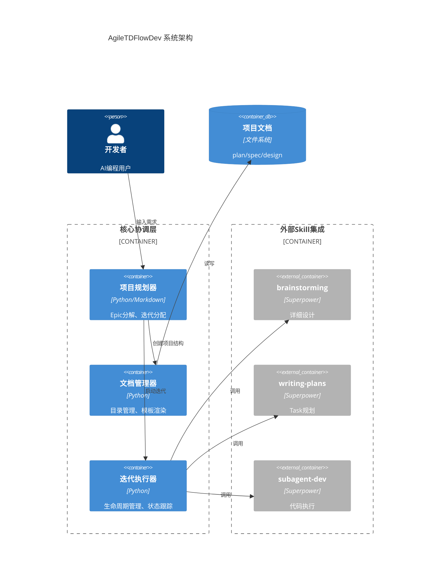

**更新记录**

| 版本 | 日期 | 作者 | 原因 |
|:---:|:---:|:---:|:---|
| 1.a | 2026-03-26 | 架构师 | 初始架构（详细版）|
| 1.b | 2026-03-26 | 架构师 | 精简为架构愿景格式，聚焦关键决策 |

---

# 高阶架构设计

## 1. 架构愿景

构建AgileTDFlowDev系统，作为AI辅助软件开发的**项目级统筹中枢**，整合分散的skills（brainstorming、writing-plans等）形成完整工作流，实现从需求输入到迭代执行的全生命周期管理，同时提供中文文档自动生成和代码库上下文理解能力。

---

## 2. 关键决策

| 决策点 | 选择方案 | 备选方案 | 选择理由 |
|:-------|:---------|:---------|:---------|
| **架构风格** | 模块化Skill集成架构 | 统一平台/独立工具链 | 复用现有superpowers skills，降低实现风险，保持各skill独立演进能力 |
| **文档组织** | 项目隔离的文件系统结构 | 统一知识库/数据库存储 | 简单可版本控制，符合开发者现有工作习惯，无需额外基础设施 |
| **上下文理解** | 基于文件分析的轻量级扫描 | AST级深度分析/AI训练 | 在精度与复杂度间平衡，MVP阶段足够使用，迭代4后可增强 |

---

## 3. 组件边界

---

## 4. 扩展策略

- **多项目组合管理**（迭代5+）：当前单项目模式 → 支持项目间依赖与资源协调
- **AI训练数据收集**（迭代5+）：匿名化收集迭代数据，用于优化规划建议
- **Web界面**（未来）：当前CLI为主 → 可选的Web看板（非必需，低优先级）

---

## 5. 演进路线

| 迭代 | 架构焦点 | 关键产出 |
|:---:|:---|:---|
| 迭代1 | 项目规划工作流 | 核心协调层、中文文档模板 |
| 迭代2 | 文档组织机制 | 项目目录标准、自动初始化 |
| 迭代3 | 模板渲染引擎 | 团队风格模板系统 |
| 迭代4 | 代码库理解 | 文件分析扫描器 |
| 迭代5+ | 集成优化 | 性能优化、扩展机制完善 |

---

*AlgoTech Future（ATF）架构文档*

**文档边界**：本文档为架构愿景，详细组件设计将在各迭代启动时通过brainstorming生成。
