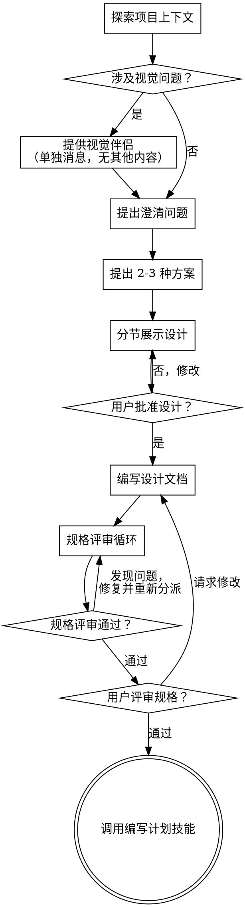

# 头脑风暴：从想法到设计

通过自然协作对话，帮助将想法转化为完整的设计和规格说明。

首先理解当前项目上下文，然后逐一提问以细化想法。一旦理解了要构建的内容，展示设计并获得用户批准。

<HARD-GATE>
在呈现设计并获得用户批准之前，**禁止**调用任何实现技能、编写任何代码、搭建任何项目或采取任何实现行动。这适用于**每个**项目，无论其看起来多么简单。
</HARD-GATE>

## 反模式："这太简单了不需要设计"

每个项目都要经过这个过程。待办列表、单功能工具、配置变更——所有这些。"简单"项目是未经审视的假设造成最多浪费的地方。对于真正简单的项目，设计可以很短（几句话），但你**必须**展示设计并获得批准。

## 检查清单

你必须为以下每个项目创建任务并按顺序完成：

1. **探索项目上下文** — 检查文件、文档、最近提交
2. **提供视觉伴侣**（如果话题涉及视觉问题）— 单独一条消息，不与其他澄清问题合并。见下方的视觉伴侣部分
3. **提出澄清问题** — 逐一提问，理解目的/约束/成功标准
4. **提出 2-3 种方案** — 包含权衡对比和你的推荐
5. **展示设计** — 根据复杂度分节展示，每节后获得用户批准
6. **编写设计文档** — 保存到 `docs/superpowers/specs/YYYY-MM-DD-<主题>-design.md` 并提交
7. **规格评审循环** — 分派规格文档评审子智能体，提供精心设计的评审上下文（永远不要使用你的会话历史）；修复问题并重新分派直到批准（最多 3 轮，然后上报给人类）
8. **用户评审书面规格** — 请用户评审规格文件后再继续
9. **过渡到实现** — 调用编写计划技能创建实现计划

## 流程图

**终止状态是调用编写计划。** 不要调用前端设计、mcp 构建器或任何其他实现技能。头脑风暴后唯一调用的技能是编写计划。

## 流程说明

**理解想法：**

- 首先检查当前项目状态（文件、文档、最近提交）
- 在问详细问题之前，评估范围：如果请求描述了多个独立子系统（如"构建一个包含聊天、文件存储、计费和分析的平台"），立即标记。不要花时间细化需要分解的项目细节。
- 如果项目太大无法单次规格说明，帮助用户分解为子项目：有哪些独立的部分，它们如何关联，应该按什么顺序构建？然后通过正常的设计流程头脑风暴第一个子项目。每个子项目有自己的规格 → 计划 → 实现周期。
- 对于适当规模的项目，逐一提问以细化想法
- 尽可能使用多选题，但开放式问题也可以
- 每条消息只问一个问题——如果话题需要更多探索，拆分为多个问题
- 聚焦理解：目的、约束、成功标准

**探索方案：**

- 提出 2-3 种不同方案并对比权衡
- 以对话方式呈现选项，附带你的推荐和理由
- 以推荐选项开头并解释原因

**展示设计：**

- 一旦你认为理解了要构建的内容，展示设计
- 根据每节的复杂度调整长度：简单的几句话，复杂的 200-300 词
- 每节后询问到目前为止是否正确
- 覆盖：架构、组件、数据流、错误处理、测试
- 如有不清晰之处，准备好返回澄清

**为隔离和清晰而设计：**

- 将系统拆分为小单元，每个有明确目的，通过定义良好的接口通信，可独立理解和测试
- 对每个单元，你应该能回答：它做什么，如何使用，依赖什么？
- 有人能不读内部就理解单元做什么吗？能不破坏消费者就修改内部吗？如果不能，边界需要调整。
- 小、边界清晰的单元也更容易处理——你能一次在上下文中推理的代码，编辑更可靠。文件变大通常是做得太多的信号。

**在现有代码库中工作：**

- 在提议变更前探索当前结构。遵循现有模式。
- 现有代码有问题影响工作时（如文件太大、边界不清、职责纠缠），将针对性改进作为设计的一部分——就像优秀开发者改进他们工作的代码一样。
- 不要提议无关重构。聚焦服务于当前目标的内容。

## 设计之后

**文档：**

- 将验证过的设计（规格）写入 `docs/superpowers/specs/YYYY-MM-DD-<主题>-design.md`
  - （用户对规格位置的偏好覆盖此默认）
- 如果可用，使用写作风格技能
- 将设计文档提交到 git

**规格评审循环：**
编写规格文档后：

1. 分派规格文档评审子智能体（见 spec-document-reviewer-prompt.md）
2. 如果发现问题：修复，重新分派，重复直到批准
3. 如果循环超过 3 轮，上报给人类寻求指导

**用户评审关卡：**
规格评审循环通过后，请用户评审书面规格再继续：

> "规格已编写并提交到 `<路径>`。请评审，如有修改需求请告知，我们再开始编写实现计划。"

等待用户回复。如果他们请求修改，进行修改并重新运行规格评审循环。仅在用户批准后继续。

**实现：**

- 调用编写计划技能创建详细实现计划
- **不要**调用任何其他技能。编写计划是下一步。

## 关键原则

- **一次一个问题** — 不要用多个问题淹没用户
- **优先多选题** — 比开放式更容易回答（如果可能）
- **无情践行 YAGNI** — 从所有设计中移除非必要功能
- **探索替代方案** — 确定前总是提出 2-3 种方案
- **增量验证** — 展示设计，继续前获得批准
- **保持灵活** — 有不合理之处时返回澄清

## 视觉伴侣

用于头脑风暴期间展示 mockup、图表和视觉选项的浏览器伴侣。作为工具可用 —— 不是模式。接受伴侣意味着它可用于受益于视觉处理的问题；**不**意味着每个问题都通过浏览器。

**提供伴侣：** 当你预见即将到来的问题将涉及视觉内容（mockup、布局、图表）时，一次性提供以获取同意：
> "我们正在做的一些内容，如果能在网页浏览器中展示给你可能会更容易解释。我可以随时准备 mockup、图表、对比和其他视觉内容。这个功能还比较新，token 消耗可能较高。想试试吗？（需要打开本地 URL）"

**这个提议必须是单独的消息。** 不要与澄清问题、上下文摘要或任何其他内容合并。消息应该只包含上面的提议，别无其他。等待用户回复再继续。如果他们拒绝，继续纯文本头脑风暴。

**逐问题决策：** 即使用户接受了，也要**对每个问题**决定是否使用浏览器或终端。测试：**用户通过看到比读到更容易理解吗？**

- **使用浏览器** 用于**视觉**内容 —— mockup、线框、布局对比、架构图、并排视觉设计
- **使用终端** 用于**文本**内容 —— 需求问题、概念选择、权衡列表、A/B/C/D 文本选项、范围决策

关于 UI 话题的问题不自动是视觉问题。"这个上下文中个性是什么意思？"是概念问题 —— 用终端。"哪种向导布局更好？"是视觉问题 —— 用浏览器。

如果他们同意伴侣，继续前阅读详细指南：
`skills/brainstorming/visual-companion.md`
