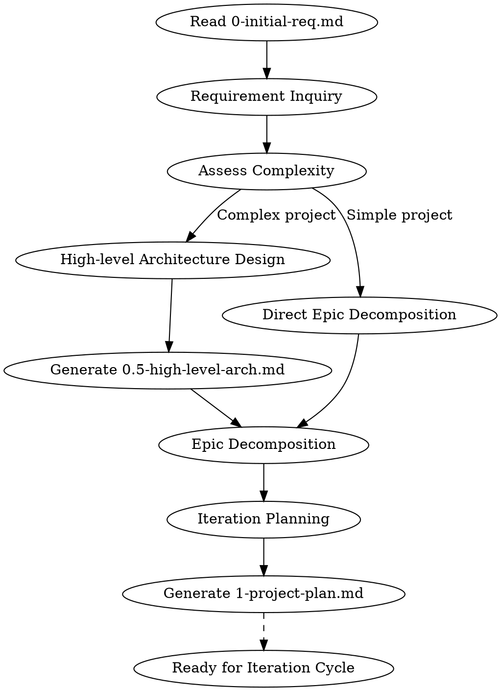

> ⚠️ **注意**：这是 SKILL.md 的中文对照版本，用于团队成员理解技能逻辑。
>
> - 执行时请使用英文版 `SKILL.md`
> - 当英文版本更新时，此文档需同步更新
> - 当前同步版本：SKILL.md v1.a

---
name: project-planning
description: Use when transforming initial requirements into a project plan with optional high-level architecture, supporting rolling wave planning for iterative development
---

# 项目规划 (Project Planning)

## 概述 (Overview)

将 `0-initial-req.md` 转换为 `1-project-plan.md`，对于复杂项目可选择生成 `0.5-high-level-arch.md`。

**开始时声明：** "我正在使用项目规划技能，根据您的初始需求创建项目计划。"

**输入：** `0-initial-req_YYYYMMDD_v{X}.{Y}.md` (客户需求)
**输出：**
- `0.5-high-level-arch_YYYYMMDD_v{X}.{Y}.md` (可选，用于复杂项目)
- `1-project-plan_YYYYMMDD_v{X}.{Y}.md` (包含 Epics 和迭代路线图的项目计划)

**关键概念：**
- **滚动式规划 (Rolling Wave Planning)**：项目计划迭代演进 - 只有近期迭代需要详细规划
- **规划范围 (Planning Horizon)**：详细级（当前+1个迭代）/ 大纲级（接下来2-3个迭代）/ 愿景级（未来）
- **Epic (史诗)**：可能跨越多个迭代的大型需求

## 流程 (The Process)



### 阶段1：需求澄清 (Phase 1: Requirements Clarification)

阅读 `0-initial-req.md` 并识别：
- 不清晰的需求（矛盾、歧义、边界）
- 规划所需的缺失信息
- 技术约束和假设

**一次只问一个澄清问题**，直到需求足够清晰可以开始规划。

### 阶段2：复杂度评估 (Phase 2: Complexity Assessment)

确定是否需要高阶架构文档：

| 条件 | 需要架构文档 |
|-----------|----------------------------|
| 新系统/平台 | 是 |
| 3个以上交互组件/服务 | 是 |
| 关键技术决策 | 是 |
| 简单功能增强 | 否 |
| 单文件工具 | 否 |

### 阶段3：高阶架构设计（如需要）(Phase 3: High-level Architecture)

创建 `0.5-high-level-arch.md`，包含：
- 架构愿景和关键能力
- 组件图（C4容器级别）
- 组件职责和接口
- 主要用例的数据流
- 技术选型（附理由）
- 演进路线图（哪些部分是详细/大纲/愿景级）

### 阶段4：Epic分解 (Phase 4: Epic Decomposition)

将需求分解为 Epics：
- 每个 Epic 应交付用户可见的价值
- Epics 可以跨越多个迭代
- 优先级：关键 > 高 > 中 > 低

### 阶段5：迭代规划（滚动式）(Phase 5: Iteration Planning)

按三个范围级别规划：

| 范围 | 详细程度 | 内容 |
|---------|-------------|---------|
| **详细级** | 任务级 | 当前 + 下一个迭代 |
| **大纲级** | Epic级 | 接下来2-3个迭代 |
| **愿景级** | 主题级 | 未来迭代 |

输出 `1-project-plan.md`，包含：
- 项目组和背景
- Epic列表（含优先级和范围状态）
- 迭代路线图
- 架构引用（如存在）

## 滚动式规划 (Rolling Wave Planning)

项目计划**不是固定的** - 它在迭代之间演进：

1. **开始**：只有迭代1需要详细规划
2. **迭代之间**：基于复盘，细化下一个迭代的计划
3. **升级范围**：随着项目进展，大纲级 -> 详细级，愿景级 -> 大纲级

在 `1-project-plan.md` 版本历史中记录变更。

## 与其他技能的集成 (Integration with Other Skills)

**下游技能：**
- `superpowers:brainstorming` - 在迭代周期中用于每个Epic的详细设计
- `superpowers:writing-plans` - 从Epic设计创建实施计划
- `superpowers:subagent-driven-development` - 执行计划

**工作流顺序：**
```
project-planning (项目级)
    |
    v
brainstorming (每个Epic的详细设计)
    |
    v
writing-plans (实施计划)
    |
    v
subagent-driven-development (执行)
    |
    v
[复盘] -> [更新项目计划] -> [下一迭代]
```

## 文档格式 (Document Formats)

### 0-initial-req.md 输入格式

```yaml
---
doc_type: project-proposal
version: "1.0"
updated: "2026-03-26"
company: {name: "{{COMPANY_NAME}}", short: "{{COMPANY_SHORT}}"}
---

# 立项报告与需求列表

## 1 背景介绍
...

## 2 项目/产品价值
...

## 3 项目需求
### 3.3 需求列表
| 序号 | 名称 | 描述 | 优先级别 |
|:---:|:---|:---|:---:|
| 1 | ... | ... | 关键 |
```

### 0.5-high-level-arch.md 输出格式

```yaml
---
doc_id: "ATF-ARCH-001"
doc_type: high-level-architecture
project_name: "ProjectName"
version: "1.a"
updated: "2026-03-26"
status: evolving
scope:
  current: "Core framework"
  future: "Plugin ecosystem"
---

# 高阶架构设计

## 1. 架构愿景
...

## 2. 总体架构图
...

## 3. 核心组件
...

## 4. 数据流
...

## 5. 技术选型
...

## 6. 演进路线
| 迭代 | 架构细化范围 |
|:---:|:---|
| 迭代1 | 核心引擎模块 |
| 迭代2 | 插件加载机制 |
```

### 1-project-plan.md 输出格式

```yaml
---
doc_id: "ATF-PROJ-001"
doc_type: project-plan
project_name: "ProjectName"
version: "1.a"
updated: "2026-03-26"
status: rolling
planning_horizon:
  detailed: "迭代1-2"
  outline: "迭代3-5"
  vision: "迭代6+"
---

# 项目计划

## 1 项目组成员
...

## 2 项目背景介绍
...

## 3 项目价值
...

## 4 计划需求列表 (Epics)
| 编号 | 名称 | 描述 | 优先级 | 状态 | 目标迭代 |
|:---:|:---|:---|:---:|:---:|:---:|
| FR1 | 核心引擎 | ... | 关键 | detailed | 迭代1-2 |
| FR2 | 用户界面 | ... | 高 | outline | 迭代3-4 |

## 5 迭代规划
### 5.1 迭代1 - 详细规划
...

### 5.2 迭代2-3 - 大纲规划
...

### 5.3 迭代4+ - 愿景规划
...

## 6 技术架构
- **高阶架构**: `0.5-high-level-arch_YYYYMMDD_vX.Y.md`
- **架构状态**: evolving
```

## 关键原则 (Key Principles)

- **YAGNI**：不要过度规划遥远的迭代
- **增量式**：只规划足够让下一迭代开始的内容
- **适应性**：根据复盘学习更新计划
- **可追溯**：将Epics链接回初始需求
