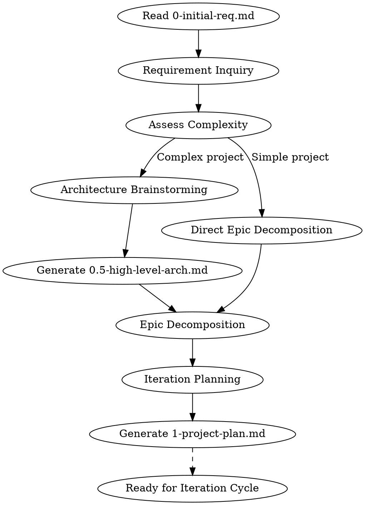
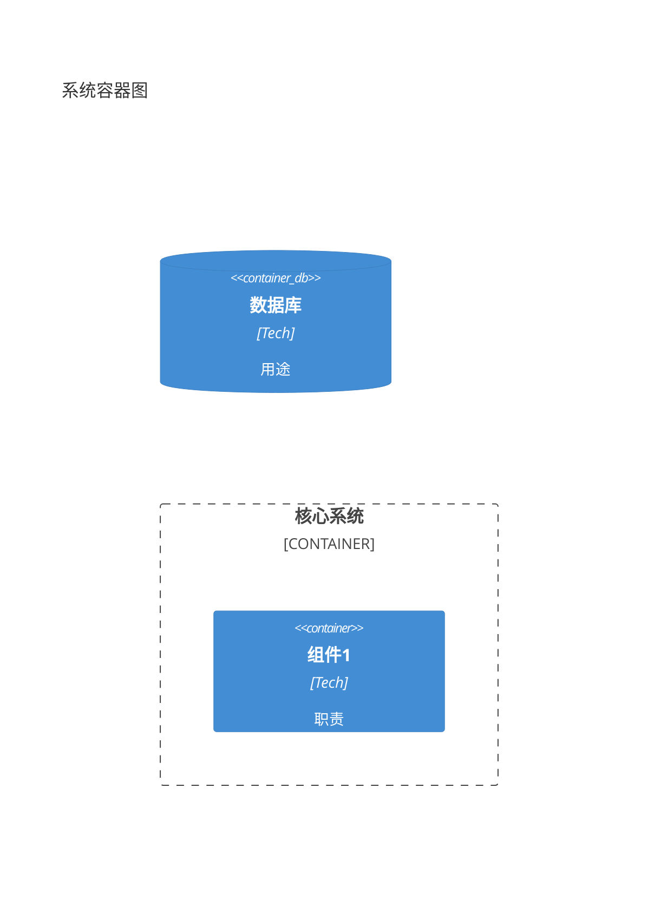

# Project Planning

## Overview

Transform `0-initial-req.md` into `1-project-plan.md` with optional `0.5-high-level-arch.md` for complex projects.

**Announce at start:** "I'm using the project-planning skill to create a project plan from your initial requirements."

**Input:** `0-initial-req_YYYYMMDD_v{X}.{Y}.md` (customer requirements)
**Outputs:**
- `0.5-high-level-arch_YYYYMMDD_v{X}.{Y}.md` (optional, for complex projects)
- `1-project-plan_YYYYMMDD_v{X}.{Y}.md` (project plan with epics and iteration roadmap)

**Key Concepts:**
- **Rolling Wave Planning**: Project plan evolves iteratively - only immediate iterations need detailed planning
- **Planning Horizon**: detailed (current+1 iteration) / outline (next 2-3) / vision (future)
- **Epic**: Large requirement that may span multiple iterations

## The Process



### Phase 1: Requirements Clarification

Read `0-initial-req.md` and identify:
- Unclear requirements (contradictions, ambiguities, boundaries)
- Missing information needed for planning
- Technical constraints and assumptions

**Ask clarifying questions one at a time** until requirements are clear enough for planning.

### Phase 2: Complexity Assessment

Determine if high-level architecture is needed:

| Condition | Needs Architecture Document |
|-----------|----------------------------|
| New system/platform | Yes |
| 3+ interacting components/services | Yes |
| Critical technology decisions | Yes |
| Simple feature enhancement | No |
| Single-file utility | No |

### Phase 3: Architecture Brainstorming & Vision (if needed)

对于需要架构文档的复杂项目，使用`superpowers:brainstorming`进行**轻量级架构brainstorming**：

**Announce:** "Using superpowers:brainstorming to explore architecture decisions before creating the high-level vision."

**Brainstorming Focus (2-3个关键决策):**
1. **识别关键架构问题**（不超过3个）
   - 例："单体 vs 微服务"、"核心数据结构选择"、"关键接口边界"

2. **快速方案探索**（每个问题2个可行方案）
   - 方案A：简洁实现，快速交付
   - 方案B：考虑扩展，适度抽象

3. **权衡与决策**
   - 基于项目约束做出选择
   - 记录决策理由（简洁即可）

**Output: 简洁的架构愿景文档** `0.5-high-level-arch.md`：
- 不超过2页
- 聚焦：关键决策、组件边界、扩展策略
- **不包含**：详细接口、完整数据流、实现细节

**架构愿景模板:**
```markdown
## 1. 架构愿景（1段话）
## 2. 关键决策（2-3个决策点 + 选择理由）
## 3. 组件边界（简化的C4 Container，仅核心组件）
## 4. 扩展策略（预留的扩展点）
## 5. 演进路线（与project-plan迭代对齐）
```

### Phase 4: Epic Decomposition

Break requirements into Epics:
- Each Epic should deliver user-visible value
- Epics can span multiple iterations
- Prioritize: Critical > High > Medium > Low

### Phase 5: Iteration Planning (Rolling Wave)

> **边界明确**：迭代规划**仅**将 Epic 分配到迭代，**不涉及**详细需求分解或 Task 级规划。
>
> 每个迭代的详细执行计划（包括需求细化、验收标准、Task 分解）将在**迭代启动时**通过 brainstorming 技能生成。

Plan with three horizon levels:

| Horizon | Detail Level | Content |
|---------|-------------|---------|
| **Detailed** | Epic assignments confirmed | Current + next iteration (which Epics) |
| **Outline** | Epic assignments tentative | Next 2-3 iterations (which Epics) |
| **Vision** | Theme-level direction | Future iterations (themes only) |

**Output `1-project-plan.md` iteration section format:**

```markdown
### 5.1 迭代1 - 详细规划
**涉及Epic:** FR1, FR2
**说明:** 详细执行计划在迭代启动时通过brainstorming生成

### 5.2 迭代2 - 大纲规划
**涉及Epic:** FR3

### 5.3 迭代3+ - 愿景规划
**主题:** 性能优化与扩展
```

## Rolling Wave Planning

Project plan is **not frozen** - it evolves between iterations:

1. **Start**: Project plan only assigns Epics to iterations
2. **Before each iteration**: Use brainstorming skill to:
   - Select Epics assigned to this iteration
   - Decompose into detailed requirements and Tasks
   - Generate iteration specification
3. **Between iterations**: Based on retrospective, adjust Epic assignments
4. **Upgrade horizon**: As project progresses, outline → detailed, vision → outline

Document changes in `1-project-plan.md` version history.

## Integration with Other Skills

**Downstream skills:**
- `superpowers:brainstorming` - **Two-phase usage:**
  1. **Project planning phase**: Architecture decision exploration (if high-level arch needed)
  2. **Iteration phase**: Per-Epic detailed design
- `superpowers:writing-plans` - Creates implementation plan from Epic design
- `superpowers:subagent-driven-development` - Executes the plan

**Workflow sequence:**
```
project-planning (project level)
    |
    ├─→ brainstorming (architecture decisions, if needed) → 0.5-high-level-arch.md
    |
    v
Epic Decomposition → 1-project-plan.md
    |
    v
brainstorming (per-Epic detailed design)
    |
    v
writing-plans (implementation plan)
    |
    v
subagent-driven-development (execution)
    |
    v
[Retrospective] -> [Update project-plan] -> [Next iteration]
```

## Document Formats

### 0-initial-req.md Input Format

```yaml
---
doc_type: project-proposal
version: "1.0"
updated: "2026-03-26"
company: {name: "{{COMPANY_NAME}}", short: "{{COMPANY_SHORT}}"}
---

# 立项报告与需求列表

## 1 背景介绍
...

## 2 项目/产品价值
...

## 3 项目需求
### 3.3 需求列表
| 序号 | 名称 | 描述 | 优先级别 |
|:---:|:---|:---|:---:|
| 1 | ... | ... | 关键 |
```

### 0.5-high-level-arch.md Output Format

> **精简原则**：架构愿景不超过2页，聚焦关键决策和组件边界

```yaml
---
doc_id: "ATF-ARCH-001"
doc_type: high-level-architecture
project_name: "ProjectName"
version: "1.a"
updated: "2026-03-26"
status: evolving
scope:
  current: "Core framework"
  future: "Plugin ecosystem"
---

# 高阶架构设计

## 1. 架构愿景
1段话描述系统核心定位和目标

## 2. 关键决策
| 决策点 | 选择 | 理由 |
|:-------|:-----|:-----|
| 架构风格 | 单体/微服务/... | 为什么 |
| 核心数据模型 | 关系型/文档/... | 为什么 |
| 扩展机制 | 插件/配置/... | 为什么 |

## 3. 组件边界 (C4 Container)


## 4. 扩展策略
- 预留的扩展点1：...（计划迭代N实现）
- 预留的扩展点2：...（计划迭代N+1实现）

## 5. 演进路线
| 迭代 | 架构焦点 |
|:---:|:---|
| 迭代1 | 核心引擎 |
| 迭代2 | 插件机制 |
```

### 1-project-plan.md Output Format

```yaml
---
doc_id: "ATF-PROJ-001"
doc_type: project-plan
project_name: "ProjectName"
version: "1.a"
updated: "2026-03-26"
status: rolling
planning_horizon:
  detailed: "迭代1-2"
  outline: "迭代3-5"
  vision: "迭代6+"
---

# 项目计划

## 1 项目组成员
...

## 2 项目背景介绍
...

## 3 项目价值
...

## 4 计划需求列表 (Epics)
| 编号 | 名称 | 描述 | 优先级 | 状态 | 目标迭代 |
|:---:|:---|:---|:---:|:---:|:---:|
| FR1 | 核心引擎 | ... | 关键 | detailed | 迭代1-2 |
| FR2 | 用户界面 | ... | 高 | outline | 迭代3-4 |

## 5 迭代规划
### 5.1 迭代1 - 详细规划
...

### 5.2 迭代2-3 - 大纲规划
...

### 5.3 迭代4+ - 愿景规划
...

## 6 技术架构
- **高阶架构**: `0.5-high-level-arch_YYYYMMDD_vX.Y.md`
- **架构状态**: evolving
```

## Key Principles

- **YAGNI**: Don't over-plan distant iterations
- **Boundary**: This skill = Epic-to-iteration assignment only; Detailed planning = brainstorming skill at iteration start
- **Incremental**: Project plan just assigns Epics; Details emerge during iteration
- **Emergent Clarity**: Only current iteration Epic assignment is firm; future assignments are tentative
- **Progressive Elaboration**: Detailed requirements and Tasks emerge through brainstorming per-iteration
- **Adaptable**: Update plan based on retrospective learnings
- **Traceable**: Link Epics back to initial requirements
