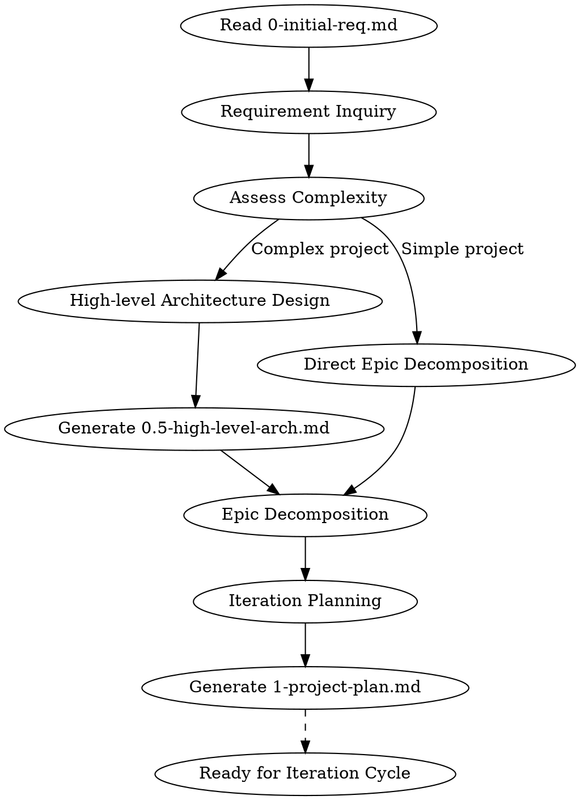

# Project Planning

## Overview

Transform `0-initial-req.md` into `1-project-plan.md` with optional `0.5-high-level-arch.md` for complex projects.

**Announce at start:** "I'm using the project-planning skill to create a project plan from your initial requirements."

**Input:** `0-initial-req_YYYYMMDD_v{X}.{Y}.md` (customer requirements)
**Outputs:**
- `0.5-high-level-arch_YYYYMMDD_v{X}.{Y}.md` (optional, for complex projects)
- `1-project-plan_YYYYMMDD_v{X}.{Y}.md` (project plan with epics and iteration roadmap)

**Key Concepts:**
- **Rolling Wave Planning**: Project plan evolves iteratively - only immediate iterations need detailed planning
- **Planning Horizon**: detailed (current+1 iteration) / outline (next 2-3) / vision (future)
- **Epic**: Large requirement that may span multiple iterations

## The Process



### Phase 1: Requirements Clarification

Read `0-initial-req.md` and identify:
- Unclear requirements (contradictions, ambiguities, boundaries)
- Missing information needed for planning
- Technical constraints and assumptions

**Ask clarifying questions one at a time** until requirements are clear enough for planning.

### Phase 2: Complexity Assessment

Determine if high-level architecture is needed:

| Condition | Needs Architecture Document |
|-----------|----------------------------|
| New system/platform | Yes |
| 3+ interacting components/services | Yes |
| Critical technology decisions | Yes |
| Simple feature enhancement | No |
| Single-file utility | No |

### Phase 3: High-level Architecture (if needed)

Create `0.5-high-level-arch.md` with:
- Architecture vision and key capabilities
- Component diagram (C4 Container level)
- Component responsibilities and interfaces
- Data flow for main use cases
- Technology choices (with rationale)
- Evolution roadmap (which parts are detailed/outline/vision)

### Phase 4: Epic Decomposition

Break requirements into Epics:
- Each Epic should deliver user-visible value
- Epics can span multiple iterations
- Prioritize: Critical > High > Medium > Low

### Phase 5: Iteration Planning (Rolling Wave)

> **Note on Progressive Elaboration**: The iteration roadmap below is a **preliminary suggestion** based on current understanding. Only the current iteration is fully detailed and committed. Subsequent iterations will emerge and clarify progressively through:
> - Retrospectives and learnings from completed iterations
> - Evolving understanding of requirements and technical challenges
> - Adaptation to changing priorities or constraints
>
> This embodies the agile principle of **emergent planning** - we maintain a clear direction while embracing the reality that distant details are inherently uncertain.

Plan with three horizon levels:

| Horizon | Detail Level | Content |
|---------|-------------|---------|
| **Detailed** | Task-level | Current + next iteration |
| **Outline** | Epic-level | Next 2-3 iterations |
| **Vision** | Theme-level | Future iterations |

Output `1-project-plan.md` with:
- Project team and background
- Epic list with priorities and horizon status
- Iteration roadmap
- Architecture reference (if exists)

## Rolling Wave Planning

Project plan is **not frozen** - it evolves between iterations:

1. **Start**: Only Iteration 1 needs detailed planning
2. **Between iterations**: Based on retrospective, refine next iteration's plan
3. **Upgrade horizon**: As project progresses, outline -> detailed, vision -> outline

Document changes in `1-project-plan.md` version history.

## Integration with Other Skills

**Downstream skills:**
- `superpowers:brainstorming` - Used per-Epic during iteration cycle for detailed design
- `superpowers:writing-plans` - Creates implementation plan from Epic design
- `superpowers:subagent-driven-development` - Executes the plan

**Workflow sequence:**
```
project-planning (project level)
    |
    v
brainstorming (per-Epic detailed design)
    |
    v
writing-plans (implementation plan)
    |
    v
subagent-driven-development (execution)
    |
    v
[Retrospective] -> [Update project-plan] -> [Next iteration]
```

## Document Formats

### 0-initial-req.md Input Format

```yaml
---
doc_type: project-proposal
version: "1.0"
updated: "2026-03-26"
company: {name: "{{COMPANY_NAME}}", short: "{{COMPANY_SHORT}}"}
---

# 立项报告与需求列表

## 1 背景介绍
...

## 2 项目/产品价值
...

## 3 项目需求
### 3.3 需求列表
| 序号 | 名称 | 描述 | 优先级别 |
|:---:|:---|:---|:---:|
| 1 | ... | ... | 关键 |
```

### 0.5-high-level-arch.md Output Format

```yaml
---
doc_id: "ATF-ARCH-001"
doc_type: high-level-architecture
project_name: "ProjectName"
version: "1.a"
updated: "2026-03-26"
status: evolving
scope:
  current: "Core framework"
  future: "Plugin ecosystem"
---

# 高阶架构设计

## 1. 架构愿景
...

## 2. 总体架构图
...

## 3. 核心组件
...

## 4. 数据流
...

## 5. 技术选型
...

## 6. 演进路线
| 迭代 | 架构细化范围 |
|:---:|:---|
| 迭代1 | 核心引擎模块 |
| 迭代2 | 插件加载机制 |
```

### 1-project-plan.md Output Format

```yaml
---
doc_id: "ATF-PROJ-001"
doc_type: project-plan
project_name: "ProjectName"
version: "1.a"
updated: "2026-03-26"
status: rolling
planning_horizon:
  detailed: "迭代1-2"
  outline: "迭代3-5"
  vision: "迭代6+"
---

# 项目计划

## 1 项目组成员
...

## 2 项目背景介绍
...

## 3 项目价值
...

## 4 计划需求列表 (Epics)
| 编号 | 名称 | 描述 | 优先级 | 状态 | 目标迭代 |
|:---:|:---|:---|:---:|:---:|:---:|
| FR1 | 核心引擎 | ... | 关键 | detailed | 迭代1-2 |
| FR2 | 用户界面 | ... | 高 | outline | 迭代3-4 |

## 5 迭代规划
### 5.1 迭代1 - 详细规划
...

### 5.2 迭代2-3 - 大纲规划
...

### 5.3 迭代4+ - 愿景规划
...

## 6 技术架构
- **高阶架构**: `0.5-high-level-arch_YYYYMMDD_vX.Y.md`
- **架构状态**: evolving
```

## Key Principles

- **YAGNI**: Don't over-plan distant iterations
- **Incremental**: Plan just enough for next iteration to start
- **Emergent Clarity**: Iteration plans are preliminary; only current iteration is fully defined
- **Progressive Elaboration**: Distant iterations clarify as we learn from each cycle
- **Adaptable**: Update plan based on retrospective learnings
- **Traceable**: Link Epics back to initial requirements
