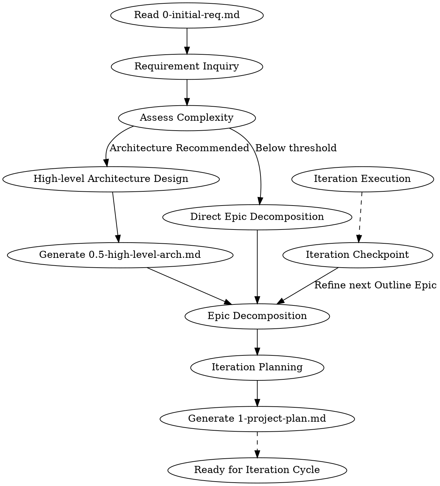
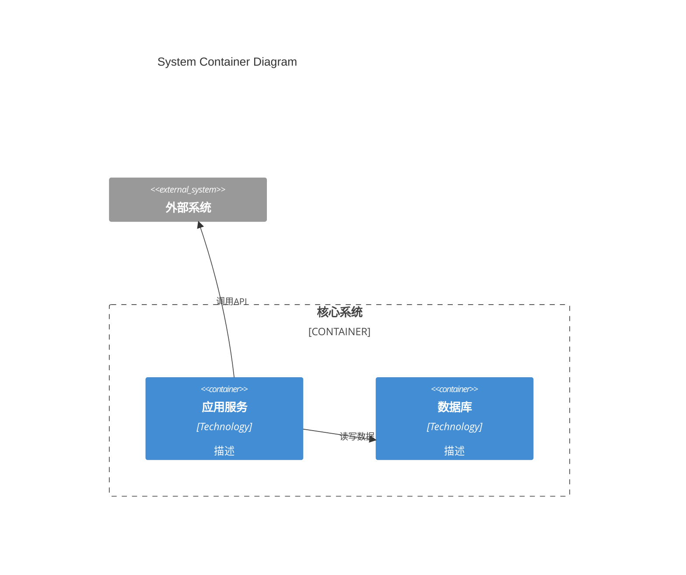
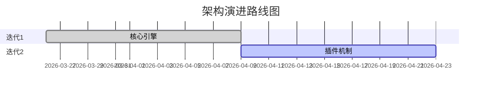

# Project Planning

## 职能边界明确

**核心原则**：本技能仅产出 **Epic级别的项目路线图**，**严禁**产出Task级代码实现步骤。

- **本技能负责**：Epic分解、迭代分配、路线图规划
- **下游技能负责**：Task级实现步骤、代码规划 (writing-plans)

## Overview

**Announce at start:** "I'm using the project-planning skill to create an Epic-level roadmap from your initial requirements. Task-level planning will be handled by writing-plans skill during iteration execution."

**Input:** `0-initial-req_YYYYMMDD_v{X}.{Y}.md` (customer requirements)
**Outputs:**
- `0.5-high-level-arch_YYYYMMDD_v{X}.{Y}.md` (optional, triggered by quantitative thresholds)
- `1-project-plan_YYYYMMDD_v{X}.{Y}.md` (Epic-level roadmap with iteration assignments)

**Key Concepts:**
- **Rolling Wave Planning**: Project plan evolves iteratively - only immediate iterations need detailed planning
- **Planning Horizon**: detailed (current+1 iteration) / outline (next 2-3) / vision (future)
- **Epic**: Large requirement that may span multiple iterations. **NOT** task-level implementation steps.
- **Boundary**: Epic planning (this skill) → Task planning (writing-plans skill)

---

## The Process



### Phase 1: Requirements Clarification (Mandatory)

**硬性约束（Inquiry First）**：在继续之前，必须确认以下要素已明确：
- ✅ 核心业务逻辑清晰（输入→处理→输出）
- ✅ 关键性能指标已定义（延迟、吞吐量、精度等）
- ✅ 集成边界明确（与哪些系统交互，接口协议）

如有任何一项不明确，**禁止**生成计划，必须先输出 Requirement Inquiry 列表。

> 详细执行过程参见 `project-planner-prompt.md` Step 1

### Phase 2: Architecture Signals Assessment

> **原则**：架构设计不是强制的，而是基于复杂性判断的建议。

评估以下信号，判断是否需要补充架构设计：

| 架构信号 | 评估问题 | 当前判断 |
|:---------|:---------|:---------|
| **数据流复杂度** | 数据是否在多组件间多方向流动？是否有复杂的转换链路？ | 高/中/低 |
| **状态管理难度** | 状态是否在多阶段变化？是否有跨组件状态同步？ | 高/中/低 |
| **性能敏感度** | 性能是否是核心约束？是否有严格的延迟/吞吐要求？ | 是/否 |
| **扩展不确定性** | 未来功能扩展方向是否不明确？架构需要预留多少灵活性？ | 高/中/低 |

**建议规则**：
- 任一信号为"高" → **建议**补充架构设计
- 性能敏感度为"是" → **建议**补充架构设计
- 所有信号为"低" + 性能不敏感 → **不建议**架构设计（YAGNI）

**输出**：在 `1-project-plan.md` 中记录：
- 信号评估结果
- 建议/不建议结论
- 理由简述（2-3句话）

### Phase 3: High-level Architecture (if triggered)

Create `0.5-high-level-arch.md` with:
- Architecture vision and key capabilities
- **Mermaid C4 Container diagram** (standardized syntax)
- Component responsibilities and interfaces (abstract only)
- Data flow for main use cases
- Technology choices (with rationale)
- **Mermaid evolution roadmap diagram**

### Phase 4: Epic Decomposition

将需求分解为 **Epics only**（功能级别，非实现级别）：
- 每个 Epic 交付用户可见价值
- Epic 可跨越多个迭代
- 优先级：关键 > 高 > 中 > 低
- **Epic粒度**：功能级，非实现级

> 详细执行过程参见 `project-planner-prompt.md` Step 3

### Phase 5: Iteration Planning (Rolling Wave)

使用三级规划视野：

| 视野 | 详细程度 | 内容 |
|:-----|:---------|:-----|
| **Detailed** | Epic分配已确认 | 当前+下一迭代 |
| **Outline** | Epic分配待定 | 未来2-3迭代 |
| **Vision** | 主题级方向 | 更远迭代（仅主题）|

**边界明确**：迭代规划**仅**将 Epic 分配到迭代，**不涉及**详细需求分解或 Task 级规划。

> 详细执行过程参见 `project-planner-prompt.md` Step 4-5

---

## Rolling Wave Planning & Update Loop

项目计划**不是固定的**——它在迭代间演进：

1. **启动**：项目计划仅将 Epic 分配到迭代
2. **迭代前**：使用 brainstorming 技能将 Epic 分解为详细需求和 Tasks
3. **迭代间**：基于复盘调整 Epic 分配
4. **视野升级**：outline → detailed, vision → outline
5. **迭代检查点**：每个迭代结束后，重新激活 project-planning skill，将下一个 outline Epic 细化为 detailed

所有变更记录在 `1-project-plan.md` 版本历史中。

---

## Integration with Other Skills

**职能边界明确**：

| 层级 | 本技能 (project-planning) | 下游技能 (writing-plans) |
|:-----|:--------------------------|:-------------------------|
| **输出** | Epic路线图、迭代分配 | Task级实现步骤、代码规划 |
| **粒度** | Feature-level | Implementation-level |
| **时机** | 项目启动、迭代Checkpoint | 迭代内执行前 |

**Downstream skills:**
- `superpowers:brainstorming` - Used per-Epic during iteration cycle for detailed design
- `superpowers:writing-plans` - **Creates task-level implementation plan from Epic** (NEVER done by this skill)
- `superpowers:subagent-driven-development` - Executes the plan

**Workflow sequence:**
```
project-planning (project level - Epic roadmap)
    ↓
brainstorming (per-Epic detailed design)
    ↓
writing-plans (task-level implementation plan) ← NOT in this skill
    ↓
subagent-driven-development (execution)
    ↓
[Retrospective] → [Iteration Checkpoint] → [Re-activate project-planning] → [Next iteration]
```

---

## Document Formats

### 0-initial-req.md Input Format

```yaml
---
doc_type: project-proposal
version: "1.0"
updated: "2026-03-26"
company: {name: "{{COMPANY_NAME}}", short: "{{COMPANY_SHORT}}"}
---

# 立项报告与需求列表

## 1 背景介绍
...

## 2 项目/产品价值
...

## 3 项目需求
### 3.3 需求列表
| 序号 | 名称 | 描述 | 优先级别 |
|:---:|:---|:---|:---:|
| 1 | ... | ... | 关键 |
```

### 0.5-high-level-arch.md Output Format

```yaml
---
doc_id: "ATF-ARCH-001"
doc_type: high-level-architecture
project_name: "ProjectName"
version: "1.a"
updated: "2026-03-26"
status: evolving
scope:
  current: "Core framework"
  future: "Plugin ecosystem"
---

# 高阶架构设计

## 1. 架构愿景
...

## 2. 总体架构图 (C4 Container)



## 3. 核心组件
...

## 4. 数据流
...

## 5. 技术选型
...

## 6. 演进路线图


```

### 1-project-plan.md Output Format

```yaml
---
doc_id: "ATF-PROJ-001"
doc_type: project-plan
project_name: "ProjectName"
version: "1.a"
updated: "2026-03-26"
status: rolling
planning_horizon:
  detailed: "迭代1-2"
  outline: "迭代3-5"
  vision: "迭代6+"
---

# 项目计划

## 1 项目组成员
...

## 2 项目背景介绍
...

## 3 项目价值
...

## 4 计划需求列表 (Epics)
| 编号 | 名称 | 描述 | 优先级 | 状态 | 目标迭代 |
|:---:|:---|:---|:---:|:---:|:---:|
| FR1 | 核心引擎 | ... | 关键 | detailed | 迭代1-2 |
| FR2 | 用户界面 | ... | 高 | outline | 迭代3-4 |

## 5 迭代规划

### 5.1 迭代1 - 详细规划
**范围：** Epic FR1
**交付标准：** [验收标准，非实现步骤]

### 5.2 迭代2-3 - 大纲规划
**范围：** Epics FR2, FR3

### 5.3 迭代4+ - 愿景规划
**范围：** 主题级描述

## 6 迭代检查点记录

| 检查点 | 日期 | 处理的Epic | 计划版本 | 备注 |
|:---:|:---:|:---:|:---:|:---|
| CP-1 | YYYY-MM-DD | FR2 | 1.b | 从outline转为detailed |

## 7 技术架构
- **高阶架构**: `0.5-high-level-arch_YYYYMMDD_vX.Y.md`
- **架构状态**: evolving
```

---

## Key Principles

- **Boundary**: This skill = Epic roadmap only; Task planning = writing-plans skill
- **YAGNI**: Don't over-plan distant iterations
- **Incremental**: Plan just enough for next iteration to start
- **Emergent Clarity**: Iteration plans are preliminary; only current iteration is fully defined
- **Progressive Elaboration**: Distant iterations clarify as we learn from each cycle
- **Update Loop**: Mandatory Iteration Checkpoint after each iteration
- **Traceable**: Link Epics back to initial requirements
