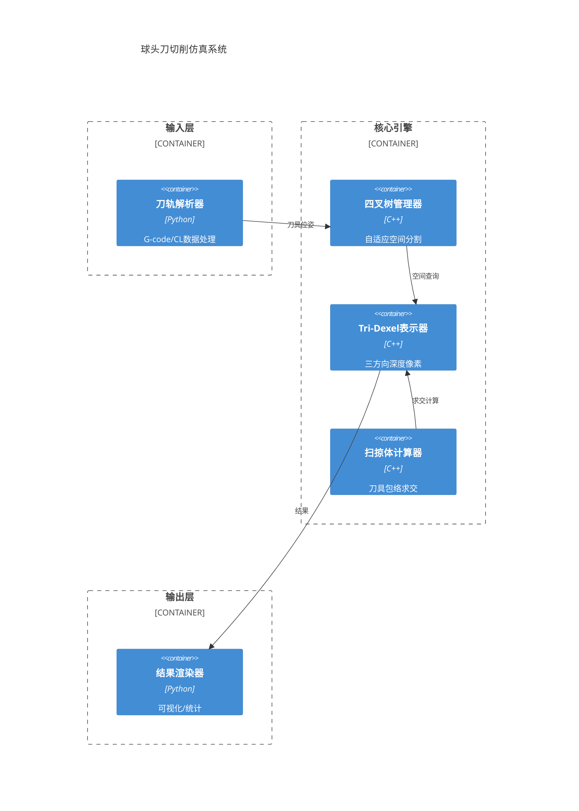

**更新记录**

| 版本 | 日期 | 作者 | 原因 |
|:---:|:---:|:---:|:---|
| 1.a | 2026-03-26 | 架构师 | 初始架构（详细版）|
| 1.b | 2026-03-26 | 架构师 | 精简为架构愿景格式 |

---

# 高阶架构设计

## 1. 架构愿景

构建基于自适应四叉树 + Tri-Dexel 的高效球头刀切削仿真算法库，替代现有体素法方案，实现10倍计算加速和10倍精度提升，支撑CAM软件国产化。

---

## 2. 关键决策

| 决策点 | 选择方案 | 备选方案 | 选择理由 |
|:-------|:---------|:---------|:---------|
| **空间索引** | 自适应四叉树 | 均匀网格/Octree | 在切削密集区提高精度，稀疏区节省内存，比均匀网格节省50%+内存 |
| **几何表示** | Tri-Dexel | 纯体素/B-rep | 体素法精度低，B-rep计算复杂；Tri-Dexel在精度和速度间平衡 |
| **实现语言** | Python + Numba | C++/CUDA原生 | Python快速验证算法，Numba加速热点；CUDA留作迭代5优化 |

---

## 3. 组件边界

---

## 4. 扩展策略

- **GPU并行化**（迭代5）：核心引擎保持CPU实现，增加CUDA批量求交模块
- **多刀具支持**（迭代5+）：当前球头刀 → 平底刀/圆角刀（扩展swept模块）
- **五轴联动优化**（未来）：当前三轴为主 → 完整五轴运动包络计算

---

## 5. 演进路线

| 迭代 | 架构焦点 | 关键产出 |
|:---:|:---|:---|
| 迭代1 | 基础数据结构 | Tri-Dexel实现 |
| 迭代2 | 求交算法 | 扫掠体计算器 |
| 迭代3 | 空间管理 | 自适应四叉树 |
| 迭代4 | 性能优化 | Numba加速版本 |
| 迭代5+ | 并行扩展 | CUDA模块、多刀具 |

---

*AlgoTech Future（ATF）架构文档*

**文档边界**：架构愿景仅定义关键决策和组件边界，详细设计在各迭代启动时生成。
